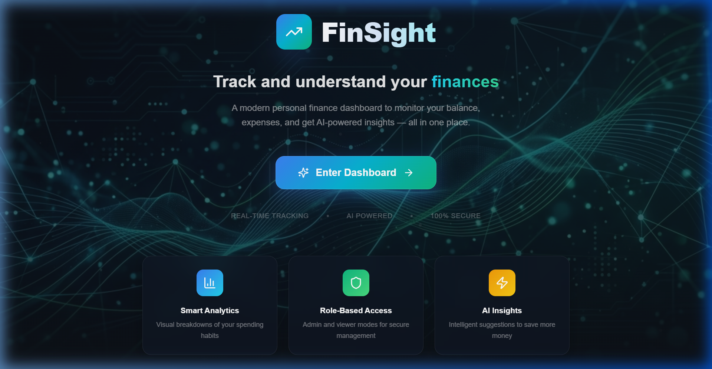
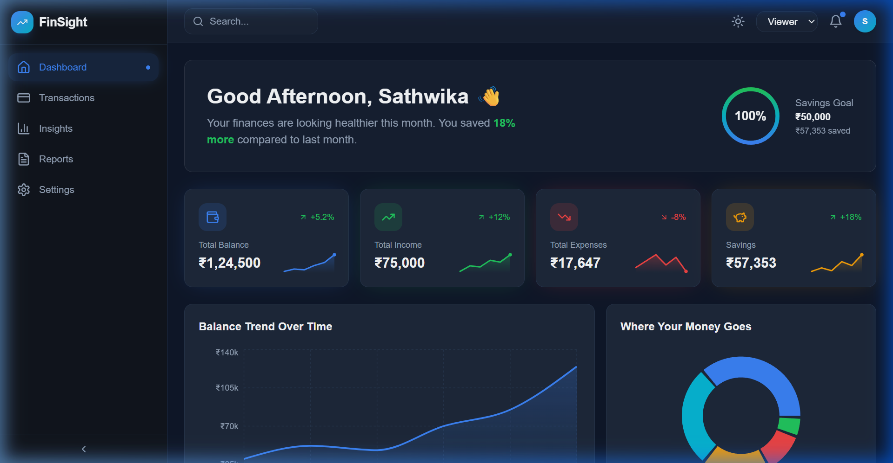
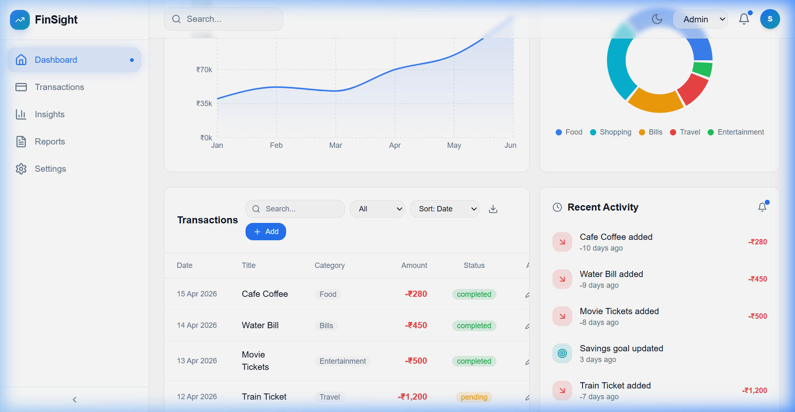
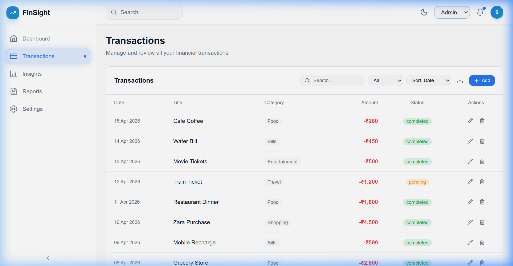
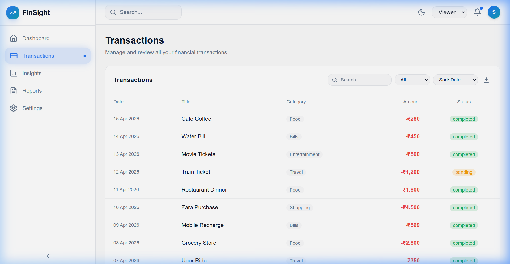
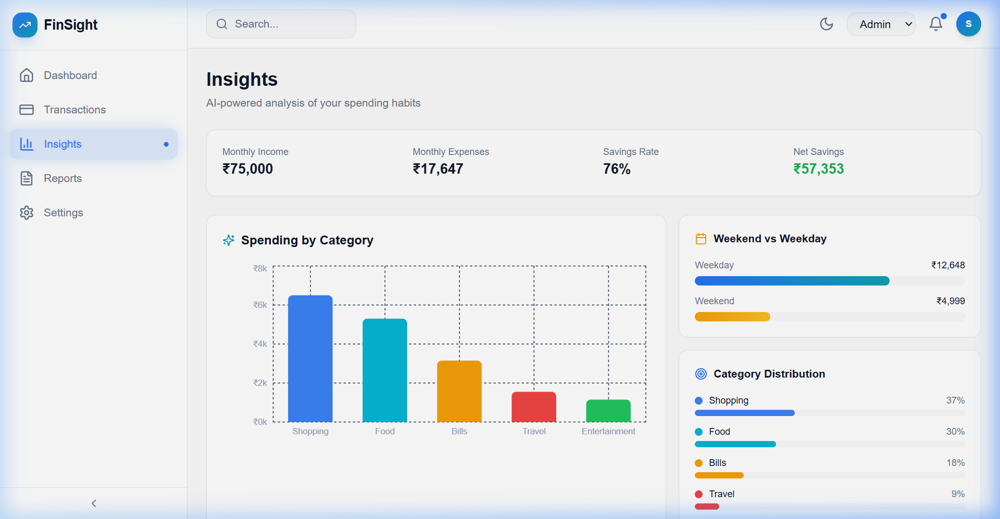
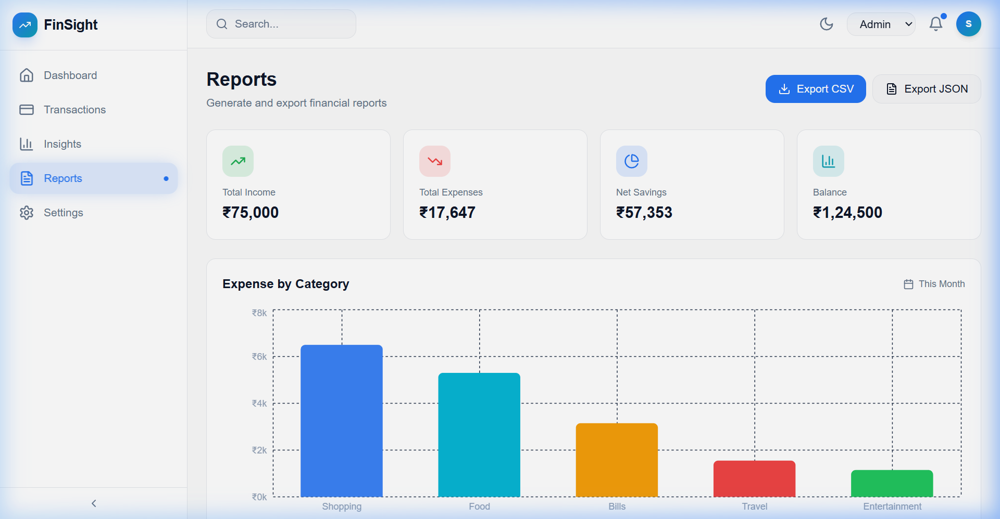
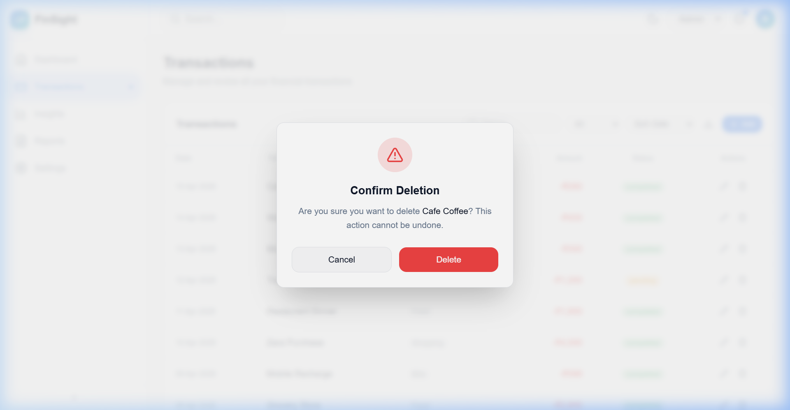
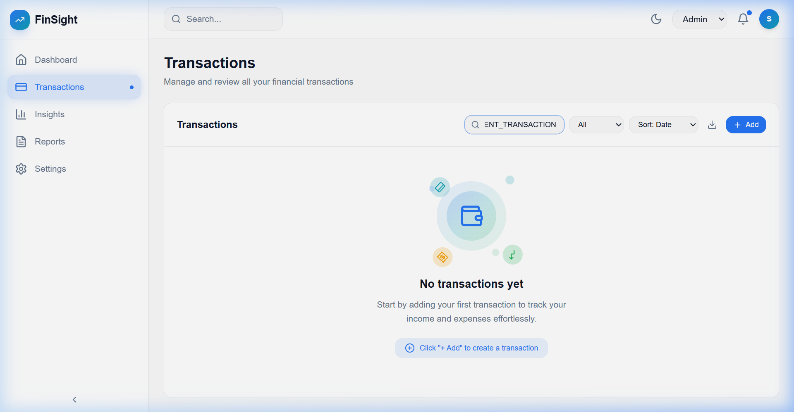
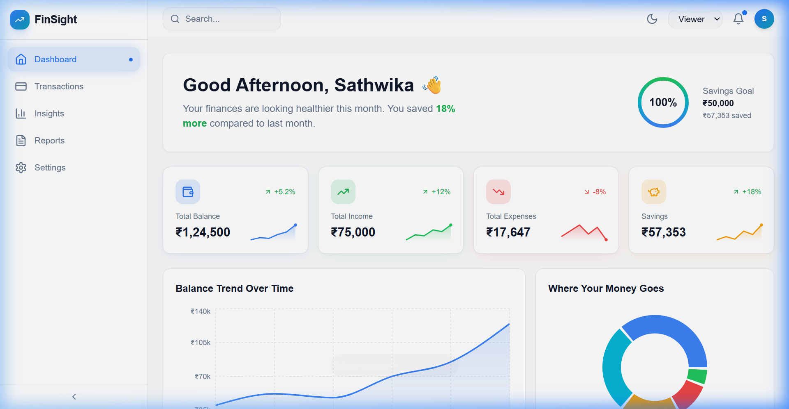

<p align="center">
  
  
  
  
</p>

# 💰 FinSight — Personal Finance Dashboard

> A modern, responsive personal finance dashboard with AI-powered insights, role-based access, and beautiful data visualizations built with React + TypeScript.

---

## 📌 Assignment Objective

This project was created for the **Frontend Developer Intern** assignment at **Zorvyn**.

The goal was to build a modern finance dashboard interface that allows users to:
- View overall financial summary
- Explore and manage transactions
- Understand spending patterns
- Experience role-based UI behavior (Admin / Viewer)

The application is fully frontend-based and uses mock data with local state management.

---

## 📋 Table of Contents

- [Assignment Objective](#-assignment-objective)
- [Getting Started](#-getting-started)
- [Screenshots](#-screenshots)
- [Tech Stack](#-tech-stack)
- [Features](#-features)
- [Project Structure](#-project-structure)
- [Role-Based Behavior](#-role-based-behavior)
- [State Management](#-state-management)
- [Design Decisions](#-design-decisions)
- [Future Improvements](#-future-improvements)
- [Author](#-author)

---

## 🚀 Getting Started

```bash
npm install
npm run dev
```

Then open:

```
http://localhost:8080
```

### Build for Production

```bash
npm run build
npm run preview
```

---

## 📸 Screenshots

### Landing Page


### Dashboard Overview


### Dashboard — Recent Activity & Transactions


### Transactions Page


### Transactions — Viewer Mode


### Insights Page


### Reports Page


### Settings Page — Delete Confirmation


### Empty State


### Light Mode vs Dark Mode

| Dark Mode | Light Mode |
|---|---|
|  |  |

---

## 🛠️ Tech Stack

| Technology | Purpose |
|---|---|
| **React 18** | UI framework with hooks and functional components |
| **TypeScript** | Type safety and better developer experience |
| **Vite** | Fast build tool and dev server |
| **TailwindCSS 3** | Utility-first CSS with custom theme variables |
| **Framer Motion** | Animations, transitions, and micro-interactions |
| **Recharts** | Responsive chart library (Bar, Line, Pie, Area) |
| **React Router v6** | Client-side routing with nested layouts |
| **Sonner** | Toast notification system |
| **Lucide React** | Modern icon library |
| **Radix UI** | Accessible headless UI primitives |
| **localStorage** | Persistent client-side state storage |

---

## ✨ Features

### Core Features

| Feature | Description |
|---|---|
| 📊 **Dashboard Overview** | Hero banner with greeting + savings goal, 4 summary cards with sparklines |
| 💳 **Transaction Management** | Full CRUD with search, filter (income/expense), sort (date/amount) |
| 📈 **Balance Trend Chart** | 6-month area chart showing balance over time |
| 🥧 **Expense Breakdown** | Animated pie chart with category distribution |
| 🤖 **AI Insights** | 6 intelligent insights including spending patterns, savings rate, weekend analysis |
| 📋 **Reports** | Monthly summary with export to CSV/JSON |
| ⚙️ **Settings** | Theme, role management, profile display, danger zone |

### Polish & UX Features

| Feature | Description |
|---|---|
| ⏰ **Recent Activity Timeline** | Real-time feed of latest transactions with relative timestamps |
| 📈 **Sparkline Charts** | Tiny animated line graphs inside each summary card |
| 🔔 **Toast Notifications** | Success toasts for add/edit/delete, theme switch, role change |
| ⚠️ **Delete Confirmation** | Animated modal with warning icon before deleting transactions |
| 🎨 **Empty State** | Beautiful animated illustration with orbiting icons when no data |
| 🌗 **Theme Switcher** | Dark/Light mode with CSS variable transitions |
| 📱 **Responsive Sidebar** | Collapsible sidebar with mobile hamburger menu |
| ✨ **Micro-animations** | Hover effects, staggered entry, spring animations throughout |
| 📥 **CSV/JSON Export** | Download transaction data in multiple formats |
| 🔍 **Search & Filter** | Real-time search across title and category |

---

## 📁 Project Structure

```
src/
├── components/
│   ├── ui/                  # Radix-based UI primitives (shadcn/ui)
│   ├── AnimatedCounter.tsx   # Animated number counter
│   ├── AppSidebar.tsx        # Navigation sidebar
│   ├── BalanceChart.tsx      # Balance trend area chart
│   ├── ConfirmDeleteModal.tsx # Delete confirmation dialog
│   ├── EmptyState.tsx        # Empty data illustration
│   ├── ExpensePieChart.tsx   # Expense breakdown donut chart
│   ├── Header.tsx            # Top nav with search, theme, role
│   ├── HeroBanner.tsx        # Greeting + savings progress ring
│   ├── InsightCards.tsx      # Quick insight mini-cards
│   ├── NavLink.tsx           # Sidebar navigation link
│   ├── RecentActivity.tsx    # Activity timeline feed
│   ├── Sparkline.tsx         # SVG sparkline chart component
│   ├── SummaryCards.tsx      # 4 metric cards with sparklines
│   ├── TransactionModal.tsx  # Add/Edit transaction form
│   └── TransactionTable.tsx  # Transaction list with CRUD
├── context/
│   ├── FinanceContext.tsx     # Transaction data + role state
│   └── ThemeContext.tsx       # Dark/Light theme state
├── data/
│   └── transactions.ts       # Default seed data + types
├── hooks/
│   └── use-toast.ts          # Toast notification hook
├── pages/
│   ├── Dashboard.tsx
│   ├── DashboardHome.tsx      # Main dashboard page
│   ├── DashboardLayout.tsx    # Layout with sidebar + header
│   ├── Insights.tsx           # AI insights page
│   ├── Landing.tsx            # Entry/landing page
│   ├── Reports.tsx            # Reports + export page
│   ├── Settings.tsx           # Settings page
│   └── Transactions.tsx
├── App.tsx                    # Root with routing
├── index.css                  # Theme variables + utilities
└── main.tsx                   # Entry point
```

---

## 🔐 Role-Based Behavior

The application supports two roles that can be switched at any time via the header dropdown or settings page:

### Admin Role 👑
- ✅ View all transactions and charts
- ✅ **Add** new transactions via "+ Add" button
- ✅ **Edit** existing transactions via pencil icon
- ✅ **Delete** transactions with confirmation modal
- ✅ Export data as CSV/JSON
- ✅ Switch between roles

### Viewer Role 👁️
- ✅ View all transactions and charts
- ❌ Cannot add transactions (button hidden)
- ❌ Cannot edit transactions (edit icon hidden)
- ❌ Cannot delete transactions (delete icon hidden)
- ✅ Export data as CSV/JSON
- ✅ Switch between roles

> **How it works:** The `role` state is stored in `FinanceContext` and persisted to `localStorage`. Components conditionally render action buttons based on `role === 'admin'` checks. The role change triggers a toast notification for user feedback.

---

## 🧠 State Management

### Architecture

The application uses **React Context API** for global state management, split into two separate contexts:

```
ThemeProvider (theme state)
  └── FinanceProvider (transaction + role state)
        └── App Components
```

### FinanceContext

```typescript
interface FinanceContextType {
  transactions: Transaction[];     // Array of all transactions
  role: Role;                       // 'admin' | 'viewer'
  setRole: (role: Role) => void;
  addTransaction: (tx) => void;     // Prepends to list
  updateTransaction: (id, tx) => void;
  deleteTransaction: (id) => void;
  totalBalance: number;             // Computed value
  totalIncome: number;              // Sum of income transactions
  totalExpenses: number;            // Sum of expense transactions
  savings: number;                  // Income - Expenses
}
```

### ThemeContext

```typescript
interface ThemeContextType {
  theme: Theme;                     // 'dark' | 'light'
  setTheme: (theme: Theme) => void;
  toggleTheme: () => void;
}
```

### Persistence

All state is persisted to `localStorage`:
- `finsight-transactions` — Transaction data (JSON)
- `finsight-role` — Current role string
- `finsight-theme` — Current theme string

On first load, the app initializes with 15 default seed transactions.

### Why Context API?

- ✅ No extra dependencies (built into React)
- ✅ Sufficient for this application's complexity
- ✅ Simple to understand and maintain
- ✅ `useCallback` used for memoized dispatch functions
- ✅ Clean separation of concerns (theme vs finance data)

---

## 🎨 Design Decisions

### Theme System
- CSS custom properties (HSL values) for all colors
- Two complete color palettes: dark (default) and light
- Smooth `transition: background-color 0.3s ease` for switching
- Glassmorphism effects with `backdrop-filter: blur()`

### Animation Strategy
- **Framer Motion** for all UI animations
- Staggered entry animations (`delay: 0.1 * index`)
- Spring physics for modals and interactive elements
- Infinite breathing animations for decorative elements

### Component Architecture
- Smart/container components (pages) vs presentational components
- Each component is self-contained with its own animations
- Reusable utility components (Sparkline, AnimatedCounter, EmptyState)

---

## 🔮 Future Improvements

- Backend integration with database
- User authentication and login
- Real-time API-based transaction syncing
- Budget planning and monthly targets
- Personalized AI recommendations
- Notification system for unusual spending

---

## 👩‍💻 Author

**Sathwika Yalla**  
B.Tech CSE (Data Science), VNR VJIET  
Frontend Developer Intern Assignment Submission

---

<p align="center">
  Built with ❤️ for <strong>Zorvyn</strong> • 2026
</p>
